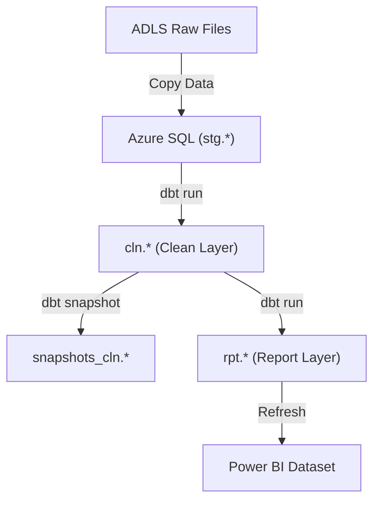
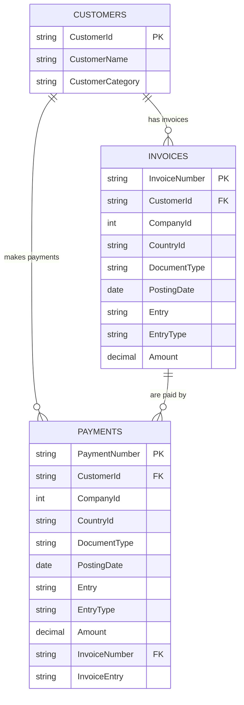

# Eurow Data Solution (Azure + dbt + ADF)

Demo projekt ukazuje kompletní datovou pipeline postavenou na **Azure Data Platform** s využitím **Azure Data Factory (ADF)**, **Azure SQL Database**, **Azure Data Lake Storage (ADLS)** a **dbt Cloud** pro transformace.

DBT
- **načítání zdrojová data (Bronze / Stage)**
- **transformování je do očištěného modelu (Silver / Clean)**
- **historizování silver vrstvy (Snapshots)**
- **příprava datového modelu pro reporting (Gold / Report)**

ADF tooling
- **bulk load raw => stage**
- **orchestrování dbt modelu/transformací**

---

## Architektura řešení

### 🔹 Vrstvy

| Vrstva | Schéma | Popis |
|---------|---------|--------|
| **Stage (Bronze)** | `stg` | Data načtená z ADLS do SQL bez úprav. |
| **Clean (Silver)** | `cln` | Očištěná data, typově sjednocená, připravená pro snapshot. |
| **Snapshots** | `snapshots_cln` | Historické záznamy (SCD2) pro audity a změnové sledování. |
| **Report (Gold)** | `rpt` | Agregace a pohledy pro Power BI reporty. |

---

## Technologie

- **Azure Data Factory (ADF)** – orchestrátor pipeline
- **Azure SQL Database** – hlavní datový úložiště
- **Azure Data Lake Storage (ADLS)** – staging soubory (CSV/XLSX)
- **dbt Cloud** – transformace, snapshoty, testy, dokumentace
- **Power BI** – reporting nad Gold vrstvou

---

## ETL Flow

## BASIC model (gold tables tbd)

